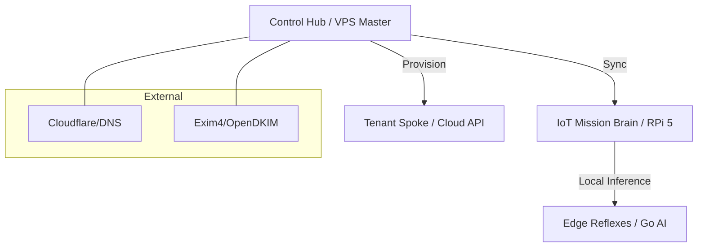

# 🚀 RokctAI PlatformStack (v2.4.1)

**PlatformStack** is the authoritative infrastructure, orchestration, and containerization layer for the RokctAI ecosystem. It defines the "Golden State" of the Frappe-based multi-tenant environment and the specialized edge-intelligence spokes.

> [!CAUTION]
> **Proprietary & Protected Architecture**
> This repository is not a standalone product. Successful builds and deployments require access to private RokctAI Monorepo overrides, protected application blueprints, and authorized GitHub secrets. Unauthorized use will result in failure during the "Golden Build" orchestration phase.

---

## 🏛️ System Architecture

PlatformStack operates on a **Unified Hub & Spoke** model, designed for high-availability cloud operations and low-latency edge intelligence.

### High-Level Topology


### 1. Control Hub (Orchestrator)
The central nervous system. Manages identity, global routing, SSL termination, and the lifecycle of all spokes.
- **Stack**: Nginx, Exim4 + OpenDKIM, Frappe Bench, Redis Cluster.
- **Database**: PostgreSQL 16 with `pgvector`, `cube`, and `earthdistance`.
- **Ports**: 80 (HTTP), 443 (HTTPS), 8000 (API), 587 (SMTP-TLS).

### 2. Tenant Spokes (Cloud Business)
Isolated, high-performance Frappe instances managed by the Control Hub.
- **Memory Profile**: 2GB Optimized.
- **Apps**: `rcore`, `brain`, `paas`.

### 3. IoT/Edge Spokes (Dual-Layer)
Specialized for hardware-integration (e.g., Drones, Sensors).
- **The Mission Brain (Frappe Spoke)**: Primary controller (RPi 5). Source of Truth for missions. (Python/Postgres).
- **The Reflexes (Edge Intelligence)**: Ultra-lean Go service for high-speed sensor fusion and local AI inference. (Go/PocketBase).

---

## 🛠️ The Golden Build Engine

At the heart of PlatformStack is `build_ecosystem.sh` — a sophisticated orchestrator that ensures every deployment is consistent and hardened.

### Key Capabilities:
- **Python 3.14+**: Universal environment management via `uv`.
- **Monorepo Overrides**: Seamlessly applies private blueprints and module overrides.
- **ROK AI Tooling**: Deep integration of the `rok` CLI agent framework.
- **Ecosystem Hacks**: Automated patching for PostgreSQL stability, API deprecations, and non-TTY CI environments.

---

## 📂 Repository Structure

```text
rokctPlatformStack/
├── platform/
│   ├── Dockerfile              # Multi-stage Golden Build
│   ├── postgres.Dockerfile     # Vector-optimized PostgreSQL 16
│   ├── docker-entrypoint.sh    # Intelligent volume seeding & recovery
│   ├── docker-compose.yml      # Control Hub Production Stack
│   ├── docker-compose.tenant.yml
│   ├── docker-compose.iot.yml  # Official Drone Brain
│   └── scripts/
│       ├── build_ecosystem.sh  # Build Orchestrator
│       └── exim4_bootstrap.sh  # Production Mail Setup
└── version.json                # Platform versioning tracking
```

---

## 🚀 Advanced Installation & Setup

PlatformStack includes a full VPS installer for bare-metal or fresh VPS provisioning.

### 1. Bare-Metal / VPS Bootstrap
```bash
# Full VPS install (System Deps + DB + Mail + Bench)
DEPLOY_MODE=fresh DB_TYPE=postgres ./install.sh

# Bench-only (Use if system deps are already satisfied)
DEPLOY_MODE=bench ./install.sh
```

### 2. Dockerized Deployment
```bash
# Cloud Control Hub
cd platform && docker compose up -d

# Drone Mission Brain (IoT)
cd platform && docker compose -f docker-compose.iot.yml up -d
```

---

## ⚙️ Environment Configuration

| Variable | Default | Description |
| :--- | :--- | :--- |
| `MODE` | `full` | `full` / `api` / `iot` — runtime profile |
| `SITE_NAME` | `platform.rokct.ai` | Primary Frappe site name |
| `DB_HOST` | `127.0.0.1` | PostgreSQL host address |
| `DB_PASSWORD` | `admin` | Database password |
| `DB_ROOT_PASS` | `admin` | PostgreSQL root credentials |
| `REDIS_CACHE` | `redis://127.0.0.1:13000` | Redis cache instance |
| `REDIS_QUEUE` | `redis://127.0.0.1:11000` | Redis queue instance |
| `INSTALL_APPS` | — | Comma-separated extra apps to fetch |

---

## 🧪 CI/CD & Compliance Lifecycle

Our **Universal Pipeline** ensures absolute stability before any image promotion:

1.  **Security Scan**: Dependency auditing and secret protection.
2.  **PR Resurrector**: Automatically re-opens stale PRs upon new activity.
3.  **The Golden Build**: Workspace synthesis and `build_ecosystem.sh` verification.
4.  **Blue/Green Upgrade Test**: Validates zero-downtime migration from previous stable version.
5.  **AI-Generated Release Notes**: 
    - **Tier 1**: Brain API (Primary)
    - **Tier 2**: Groq Llama 3.3 70B (Fallback)
    - **Tier 3**: Denoised Git Log (Legacy)

---

## 📧 Production Mail Stack

The `exim4_bootstrap.sh` script configures a production-ready mail stack on the Control Hub:
- **SMTP-TLS**: Ports 25 and 587.
- **Identity**: DKIM signing, SPF records, and OpenDKIM integration.
- **Relay**: Catch-all forwarding for administrative alerts.

---

## ⚖️ License & Copyright

(c) 2024-2026 Rokct Intelligence (pty) Ltd. All rights reserved.
**Confidential - Internal Use Only**
