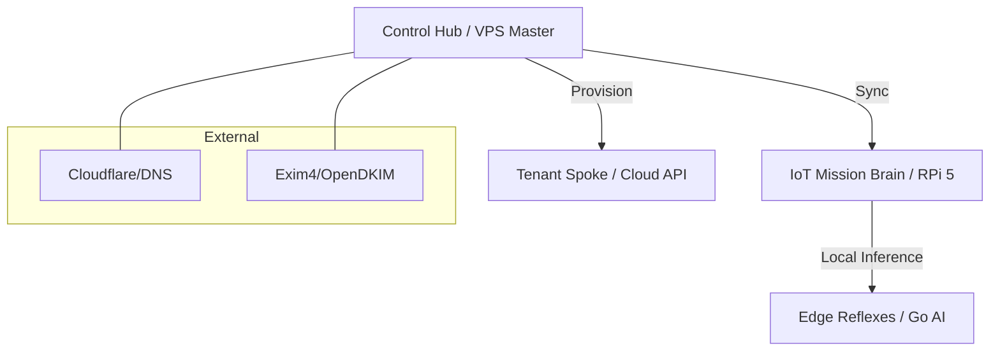

# 🚀 RokctAI PlatformStack

**PlatformStack** is the authoritative infrastructure, orchestration, and containerization layer for the RokctAI ecosystem. It defines the "Golden State" of the Frappe-based multi-tenant environment and the specialized edge-intelligence spokes.

> [!CAUTION]
> **Proprietary & Protected Architecture**
> This repository is not a standalone product. Successful builds and deployments require access to private RokctAI Occultation overrides, protected application blueprints, and authorized GitHub secrets. Unauthorized use will result in failure during the "Golden Build" orchestration phase.

---

## 🏛️ System Architecture

PlatformStack operates on a **Unified Hub & Spoke** model, designed for high-availability cloud operations and low-latency edge intelligence.

### High-Level Topology

```mermaid
graph TD
    Hub[Control Hub / VPS Master]
    SpokeT[Tenant Spoke / Cloud API]
    SpokeI[IoT Mission Brain / RPi 5]
    Edge[Edge Reflexes / Go AI]

    Hub -->|Provision| SpokeT
    Hub -->|Sync| SpokeI
    SpokeI -->|Local Inference| Edge
    
    subgraph "External"
        DNS[Cloudflare/DNS]
        Mail[Exim4/OpenDKIM]
    end
    
    Hub --- DNS
    Hub --- Mail
```

### 1. Control Hub (Orchestrator)
The central nervous system. Manages identity, global routing, SSL termination, and the lifecycle of all spokes.
- **Stack**: Nginx, Exim4 + OpenDKIM, Frappe Bench, Redis Cluster.
- **Database**: PostgreSQL 16 with `pgvector`, `cube`, and `earthdistance`.
- **Ports**: 80 (HTTP), 443 (HTTPS), 8000 (API), 587 (SMTP-TLS).

### 2. Tenant Spokes (Cloud Business)
Isolated, high-performance Frappe instances managed by the Control Hub.
- **Memory Profile**: 2GB Optimized.
- **Apps**: `rcore`.

### 3. IoT/Edge Spokes (Dual-Layer)
Specialized for hardware-integration (e.g., Drones, Sensors).
- **The Mission Brain (Frappe Spoke)**: Primary controller (RPi 5). Source of Truth for missions. (Python/Postgres).
- **The Reflexes (Edge Intelligence)**: Ultra-lean Go service for high-speed sensor fusion and local AI inference. (Go/PocketBase).

---

## 🛠️ The Golden Build Engine

At the heart of PlatformStack is `build_ecosystem.sh` — a sophisticated orchestrator that ensures every deployment is consistent and hardened.

### Key Capabilities:
- **Python 3.14+**: Universal environment management via `uv`.
- **Occultation Overrides**: Seamlessly applies private blueprints and module overrides.
- **ROK AI Tooling**: Deep integration of the `rok` CLI agent framework.
- **Ecosystem Hacks**: Automated patching for PostgreSQL stability, API deprecations, and non-TTY CI environments.

---

## 📂 Repository Structure

```text
rokctPlatformStack/
├── platform/
│   ├── Dockerfile              # Multi-stage Golden Build
│   ├── postgres.Dockerfile     # Vector-optimized PostgreSQL 16
│   ├── docker-entrypoint.sh    # Intelligent volume seeding & recovery
│   ├── docker-compose.yml      # Control Hub Production Stack
│   ├── docker-compose.tenant.yml
│   ├── docker-compose.iot.yml  # Official Drone Brain
│   ├── juvo-shell/Dockerfile   # Generic VPS-hosted Next.js shell image
│   ├── juvo-shell.env.example  # Runtime env NAMES for the juvo shell
│   └── scripts/
│       ├── build_ecosystem.sh  # Build Orchestrator
│       └── exim4_bootstrap.sh  # Production Mail Setup
└── version.json                # Platform versioning tracking
```

---

## 🚀 Advanced Installation & Setup

PlatformStack includes a full VPS installer for bare-metal or fresh VPS provisioning.

### 1. Bare-Metal / VPS Bootstrap
```bash
# Full VPS install (System Deps + DB + Mail + Bench)
DEPLOY_MODE=fresh DB_TYPE=postgres ./install.sh

# Bench-only (Use if system deps are already satisfied)
DEPLOY_MODE=bench ./install.sh
```

### 2. Dockerized Deployment
```bash
# Cloud Control Hub (the shared tenant bridge must exist first; idempotent)
docker network create rokct_tenants || true
cd platform && docker compose up -d

# Drone Mission Brain (IoT)
cd platform && docker compose -f docker-compose.iot.yml up -d
```

### 3. Tenant backend domains (shared `rokct_tenants` network)

A tenant's backend Frappe site gets a custom domain automatically: the hub
nginx (rpanel, co-installed in the hub container) terminates
`https://<custom domain>` and proxies it to the tenant's `app` container. For
that to work the two containers have to share a network, and the hub has to
be able to issue certificates. This is what `platform/` provides:

| Piece | Where | Why |
| :--- | :--- | :--- |
| `rokct_tenants` external bridge | `docker-compose.yml`, `docker-compose.tenant.yml` | The hub `app` and every tenant `app` join it. Declared `external: true` so no project creates or removes it; create it once per host with `docker network create rokct_tenants` (the Master VPS deploy step does this before `docker compose up`). |
| `<site_name>-app` alias + container name | `docker-compose.tenant.yml` | Stable upstream for the vhost: `proxy_pass http://<site_name>-app:8000`. Tenants publish **no** host port; they are reachable only from containers on `rokct_tenants` and their own project network. |
| `certbot` + `python3-certbot-nginx` | `Dockerfile` (`full` stage) | rpanel issues certs with `sudo certbot certonly --webroot -w <webroot> -d <domain>` (`rpanel/hosting/utils.py`). The ACME webroot for proxy vhosts is `/var/www/letsencrypt` (owned by `frappe`, served at `/.well-known/acme-challenge/` before the cert exists). |
| `control-letsencrypt` volume | `docker-compose.yml` | `/etc/letsencrypt` (certs, renewal configs, account keys) survives container recreation. |
| No `dns_multitenant` | `docker-entrypoint.sh` (`api` mode) | `bench use` pins the served site, so any Host header reaches it; the hub adds the domain post-provision with `bench setup add-domain` + `set-config host_name`. |

Notes for the vhost writer (rpanel): nginx inside the hub runs as
`nginx -g 'daemon off;'`, so reload with `nginx -s reload`, not `systemctl`.
Docker's embedded DNS (`127.0.0.11`) resolves the alias; use
`resolver 127.0.0.11 valid=10s;` with a variable upstream if a tenant
container's IP may change between reloads. Tenants provisioned on a remote
VPS (`target_vps_ip`) are outside this network; create `rokct_tenants` on
that host too before bringing a tenant up there, since the template declares
it external.

### 4. VPS-hosted shell (`juvo-shell`)

The juvo (delivery platform) Next.js shell runs on this VPS behind the hub
nginx instead of Vercel; other shells stay on Vercel. `docker-compose.yml`
builds it from `RokctAI/delivery-frontend` at the pinned ref
(`JUVO_SHELL_REF`, default `main`; set a commit SHA for reproducible images)
with `platform/juvo-shell/Dockerfile`, which mirrors the shell's own build
(`npm ci && bash scripts/compose.sh && npm run build`, composing offline
from the committed SDK cache) and then runs `next start` on port 3000. The
image is generic: any shell that follows that model can reuse it via the
`SHELL_REPO` / `SHELL_REF` build args.

- The service joins `rokct_tenants` under the alias `juvo-shell` and is
  **not** published to the host. rpanel proxies a tenant's shell domain the
  same way it proxies a backend domain, with `http://juvo-shell:3000` as
  the upstream (plus `Host`, `X-Forwarded-For` and `X-Forwarded-Proto`
  headers and the ACME location for the certificate).
- Runtime environment is declared by name only in
  `platform/juvo-shell.env.example`; copy it to `platform/juvo-shell.env`
  (gitignored, optional for `docker compose config`) on the VPS and fill the
  values there. `NEXT_PUBLIC_*` values are inlined at build time, so pass
  `NEXT_PUBLIC_SITE_URL` as a build arg as well.
- Private shell repos: pass a BuildKit secret named `git_token` to the
  build; it is used for the fetch only and never written to a layer.

---

## ⚙️ Environment Configuration

| Variable | Default | Description |
| :--- | :--- | :--- |
| `MODE` | `full` | `full` / `api` / `iot` — runtime profile |
| `SITE_NAME` | `platform.rokct.ai` | Primary Frappe site name |
| `DB_HOST` | `127.0.0.1` | PostgreSQL host address |
| `DB_PASSWORD` | `admin` | Database password |
| `DB_ROOT_PASS` | `admin` | PostgreSQL root credentials |
| `REDIS_CACHE` | `redis://127.0.0.1:13000` | Redis cache instance |
| `REDIS_QUEUE` | `redis://127.0.0.1:11000` | Redis queue instance |
| `INSTALL_APPS` | — | Comma-separated extra apps to fetch |

---

## 🧪 CI/CD & Compliance Lifecycle

Our **Universal Pipeline** ensures absolute stability before any image promotion:

1.  **Security Scan**: Dependency auditing and secret protection.
2.  **PR Resurrector**: Automatically re-opens stale PRs upon new activity.
3.  **The Golden Build**: Workspace synthesis and `build_ecosystem.sh` verification.
4.  **Blue/Green Upgrade Test**: Validates zero-downtime migration from previous stable version.
5.  **AI-Generated Release Notes**: 
    - **Tier 1**: Brain API (Primary)
    - **Tier 2**: Groq Llama 3.3 70B (Fallback)
    - **Tier 3**: Denoised Git Log (Legacy)

---

## 📧 Production Mail Stack

The `exim4_bootstrap.sh` script configures a production-ready mail stack on the Control Hub:
- **SMTP-TLS**: Ports 25 and 587.
- **Identity**: DKIM signing, SPF records, and OpenDKIM integration.
- **Relay**: Catch-all forwarding for administrative alerts.

---

## ⚖️ License & Copyright

(c) 2024-2026 Rokct Intelligence (pty) Ltd. All rights reserved.
**Confidential - Internal Use Only**
*Current Platform Version: 2.5.20*
